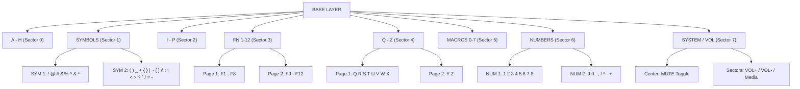

# RadPad 🎮

> **Zero-Latency Radial Gamepad Keyboard, System Input & Telemetry HUD for Android**

[-brightgreen.svg)](https://developer.android.com)
[](https://ziglang.org)
[]()
[]()

**RadPad** is a high-performance, gamepad-native input method (IME) and system companion designed for Android handheld consoles (Odin, Steam Deck, Retroid Pocket, ROG Ally running Android), Android TV, VR headsets, tablets, and emulators. 

Instead of struggling with a touchscreen keyboard or awkward on-screen letter grids using a D-pad, RadPad uses **kinematic radial dialing** with analog sticks and triggers to deliver rapid, accurate, muscle-memory typing, complete modifier control, mouse navigation, and configurable macro execution.

---

## ⚡ Key Highlights

- **Dual-Stick Kinematic Controls**:
  - **Right Analog Stick**: Aims across 8 cardinal and diagonal sectors with deadzone hysteresis.
  - **Left Analog Stick**: Acts as a 4-way modifier joystick (Tilt Right for Windows/Super, Down for Ctrl, Left for Alt, Up for Shift, Flick Right for standalone Start/Super key).
- **Hierarchical Radial Layers**:
  - Navigate through structured sub-layers: `A-H`, `SYM 1/2`, `I-P`, `FN 1-12`, `Q-Z (Q-X & Y-Z)`, `MACRO`, `NUM (1-8 & 9-0)`, and `SYS` (Volume/Mute).
  - Press **R1** to select a sector, click center **R1** or hold **R2** to toggle 2nd tier pages, and press **L1** to universally drop back to the Base layer.
- **Always-On Draggable Floating HUD**:
  - A lightweight, draggable overlay (`SYSTEM_ALERT_WINDOW`) that renders persistently over games, emulators, and full-screen applications, showing stick position, active modifiers, and layer targeting even when the soft keyboard is hidden.
- **Virtual Mouse Mode & Rootless System Gestures**:
  - Hold **R2** to seamlessly convert the Right Stick into an analog mouse pointer with precision kinematic velocity integration.
  - Full pointer controls: **Left Click** (D-Pad Left / Cross), **Right Click** (D-Pad Right / Circle), and **Middle Click** (R3 / Right Stick Click).
  - **D-Pad Scrolling**: Tap or hold **D-Pad Up** to scroll up, and **D-Pad Down** to scroll down across any app or web page via synthetic accessibility swipes.
  - **Fluid Click Ripple Animation**: Modern multi-ripple expanding wave animations with smooth energy dissipation and ample bounds padding so click circles never clip against window edges.
- **Dedicated Start & System Controls**:
  - **Start / Options Button**: Emits **Escape (ESC)** by default (customizable in Settings to Hide Keyboard or Toggle HUD).
  - **Select / Share Button**: Toggles the always-on Floating HUD and hides the soft keyboard by default (`Toggle HUD + Hide Keyboard`, customizable in Settings).
  - **R3 (Right Stick Click)**: Triggers Middle Click in Mouse Mode, and safely no-ops outside Mouse Mode.
- **Custom Macro Engine**:
  - 8 configurable radial macro slots with presets (Copy, Paste, Cut, Select All, Undo, Redo, Win+D, Alt+Tab, Task Manager) plus full custom support for complex keyboard combinations (`ctrl+shift+z`, `win+shift+s`, `alt+f4`) and arbitrary text injection (`text:hello`).
- **Symmetric & Asymmetric Geometry**:
  - Toggle between equal 45° slices (ideal for balanced diagonal navigation) and asymmetric slices (widened 60° cardinal directions with 30° diagonal cones).
- **6 Modern Color Schemes**:
  - Tokyo Night, Catppuccin Mocha, Cyberpunk Neon, OLED Stealth, Nord Frost, and Solarized Dark with live, runtime re-theming across all HUD views and overlays.
- **Bare-Metal Zig Core Engine**:
  - Performance-critical stick deflection math, trigonometric vectorization, hysteresis thresholds, and bitmask packing are implemented in Zig (`libzigengine.so`), cross-compiled with `ReleaseFast` for `aarch64-linux-android` with a zero-overhead Kotlin fallback.

---

## 🕹️ Controller Mapping Reference

| Controller Button / Stick | Default Function | Details / Modifiers |
| :--- | :--- | :--- |
| **Right Stick** | **Aim Radial Sectors / Move Mouse** | Aims radial dial sectors; controls mouse cursor when holding R2 |
| **Left Stick Tilt Right** | **SUPER / Windows (Win)** | Hold for Win combos (`Win+D`, `Win+E`, `Win+R`, `Win+Tab`, `Win+Arrows`) |
| **Left Stick Tilt Down** | **CTRL** | Hold for Ctrl shortcuts (`Ctrl+C`, `Ctrl+V`, `Ctrl+Z`, `Ctrl+A`, etc.) |
| **Left Stick Tilt Left** | **ALT** | Hold for Alt combos (`Alt+Tab`, `Alt+F4`, `Alt+Key`) |
| **Left Stick Tilt Up** | **SHIFT** | Hold for uppercase letters and secondary symbol set |
| **Left Stick Flick Right** | **Standalone Windows / Super** | Quick flick and release emits standalone Super (opens App Launcher / Start Menu) |
| **L3 (Left Stick Click)** | **Caps Lock Toggle** | Toggles persistent Caps Lock (`[CAPS]` indicator illuminates) |
| **R3 (Right Stick Click)** | **Middle Click (Mouse Mode)** | Dispatches Middle Click in Mouse Mode; unmapped / no-op outside Mouse Mode |
| **R1 (Right Bumper)** | **Select / Commit Character** | Enters sector from Base, types character in sublayer, or executes macro |
| **Center R1** | **Toggle 2nd Page** | Center stick inside `Q-Z`, `SYM`, `NUM`, or `FN` and tap R1 to toggle page |
| **L1 (Left Bumper)** | **Return to Base Layer** | Universally steps back one layer level (Page 2 $\rightarrow$ Page 1 $\rightarrow$ Base) |
| **R2 (Right Trigger)** | **Hold for 2nd Tier / Mouse Mode** | Shifts to 2nd tier while held; holding activates Virtual Mouse Mode |
| **L2 (Left Trigger)** | **Shift Modifier** | Hold for uppercase alphabet and alternate symbol characters |
| **▢ (Square / X)** | **Backspace / Forward Delete** | Single tap = Backspace. **Hold L2 / Shift** = True Forward Delete (`DEL`) |
| **✕ (Cross / A)** | **Space / Mouse Left Click** | Types space character; Left click in mouse mode |
| **△ (Triangle / Y)** | **Enter / Newline** | Commits line / enter key (supports Win/Ctrl/Alt+Enter) |
| **○ (Circle / B)** | **Tab / Mouse Right Click** | Field navigation / tab; Right click in mouse mode |
| **D-Pad Left** | **Cursor Left / Mouse Left Click** | Moves text cursor left (Snap left with Super); Left click in mouse mode |
| **D-Pad Right** | **Cursor Right / Mouse Right Click**| Moves text cursor right (Snap right with Super); Right click in mouse mode |
| **D-Pad Up** | **Cursor Up / Scroll Up** | Moves text cursor up; Smooth vertical scroll up in mouse mode |
| **D-Pad Down** | **Cursor Down / Scroll Down** | Moves text cursor down; Smooth vertical scroll down in mouse mode |
| **Start / Options** | **Escape (ESC) (Default)** | Emits Escape key (customizable in Settings: Escape, Hide Keyboard, Toggle HUD) |
| **Select / Share** | **Toggle HUD + Hide Keyboard (Default)** | Toggles always-on floating HUD and hides soft keyboard (customizable in Settings: Toggle HUD + Hide Keyboard, Toggle HUD, Hide Keyboard, Escape) |

---

## 🗺️ Layer Hierarchy

RadPad organizes characters into logical, quick-access radial slices:



- **Hysteresis Thresholds**: The radial selector requires deflecting past `0.42` radius to enter a sector, and drops back to center only when releasing below `0.25` radius. This dual-threshold hysteresis eliminates sector boundary jitter and accidental inputs.

---

## 🛠️ Project Architecture

```
RadPad/
├── app/
│   ├── build.gradle.kts             # Android Gradle build configuration (minSdk 26, targetSdk 34)
│   └── src/
│       ├── main/
│       │   ├── AndroidManifest.xml  # Manifest with IME, Overlay, & Accessibility services
│       │   ├── java/com/radpad/app/
│       │   │   ├── ControllerIME.kt             # InputMethodService handling text connection & layout
│       │   │   ├── InputEngine.kt               # State machine, geometry, layer logic & JNI bridge
│       │   │   ├── KinematicRadialHUDView.kt    # Hardware-accelerated Custom View dial renderer
│       │   │   ├── FloatingHUDService.kt        # Persistent draggable always-on overlay service
│       │   │   ├── FloatingHUDManager.kt        # Singleton dispatcher synchronizing telemetry & engine
│       │   │   ├── VirtualMouseManager.kt       # Analog cursor pointer engine with acceleration
│       │   │   ├── RadPadAccessibilityService.kt# Accessibility service executing rootless screen taps
│       │   │   ├── MacroManager.kt              # Macro storage, custom parser, & key combo executor
│       │   │   ├── ThemeManager.kt              # Color palettes, scheme manager & live observer
│       │   │   └── MainActivity.kt              # Diagnostic dashboard, settings hub & testing tester
│       │   └── res/
│       │       ├── layout/                      # UI layouts (activity_main, layout_floating_hud, ime_view)
│       │       ├── values/                      # Colors, dimensions, themes, strings
│       │       └── xml/                         # method.xml & accessibility_service_config.xml
│       └── test/
│           └── java/com/radpad/app/
│               └── InputEngineTest.kt           # Complete unit test suite for math & state machine
├── src/
│   └── main.zig                     # Bare-metal Zig 0.13 radial math & kinematics engine
├── build.zig                        # Cross-compilation script targeting aarch64-linux-android
├── gradle.properties
└── settings.gradle.kts
```

---

## 🚀 Getting Started

### Prerequisites

- **Android Studio** Hedgehog (2023.1.1) or newer / IntelliJ IDEA with Android plugin.
- **Android SDK** with build tools for API 34.
- **Zig Compiler** (Optional, 0.13.0+) for compiling the native `libzigengine.so` library (prebuilt libraries or Kotlin fallback are enabled by default).
- Android device or emulator running **Android 8.0 (API 26)** or higher with a connected gamepad (Bluetooth, USB-C, or integrated controller).

### Building and Installing

1. **Clone the repository**:
   ```bash
   git clone https://github.com/your-username/RadPad.git
   cd RadPad
   ```

2. **(Optional) Compile the Native Zig Engine**:
   ```bash
   zig build -Dtarget=aarch64-linux-android -Doptimize=ReleaseFast
   cp zig-out/lib/libzigengine.so app/src/main/jniLibs/arm64-v8a/
   ```

3. **Assemble Debug APK**:
   ```bash
   ./gradlew assembleDebug
   ```

4. **Install onto Device via ADB**:
   ```bash
   adb install -r app/build/outputs/apk/debug/app-debug.apk
   ```

---

## ⚙️ Initial Setup & Configuration

Once installed on your Android device, launch **RadPad** to complete the 3-step setup:

1. **Enable RadPad IME**: Tap **Step 1: Enable RadPad IME** in the setup card to open Android's *Manage Keyboards* settings and toggle RadPad on.
2. **Select RadPad as Current Input Method**: Tap **Step 2: Select RadPad Keyboard** to open the input method switcher and pick RadPad.
3. **Enable Accessibility System Clicks (Optional, for Mouse Mode)**: Tap **Enable Clicks** to grant accessibility permissions, enabling rootless cursor clicks anywhere on the screen.
4. **Launch Always-On Floating HUD**: Tap **📌 Launch Always-On Floating HUD** (requires "Display over other apps" permission) to activate the draggable overlay.
5. **Customize Controls**:
   - Select your preferred color theme in the **Color Scheme** dropdown.
   - Toggle **Equal 45° Slices** on or off.
   - Configure custom actions for **Select / Share** and **Start / Options** buttons.
   - Assign custom macros or text snippets to Macro Slots 0 through 7.

---

## 🧪 Testing

### Automated Kotlin Unit Tests
Execute the local JVM test suite verifying slice angles, hysteresis transitions, modifier bitmasks, and layer stacks:
```bash
./gradlew testDebugUnitTest
```

### Native Zig Tests
Execute unit tests verifying bare-metal trigonometry, cone math, and state machine transitions:
```bash
zig build test
```

---

## 📄 License

RadPad is open-source software licensed under the **Apache License 2.0**.
